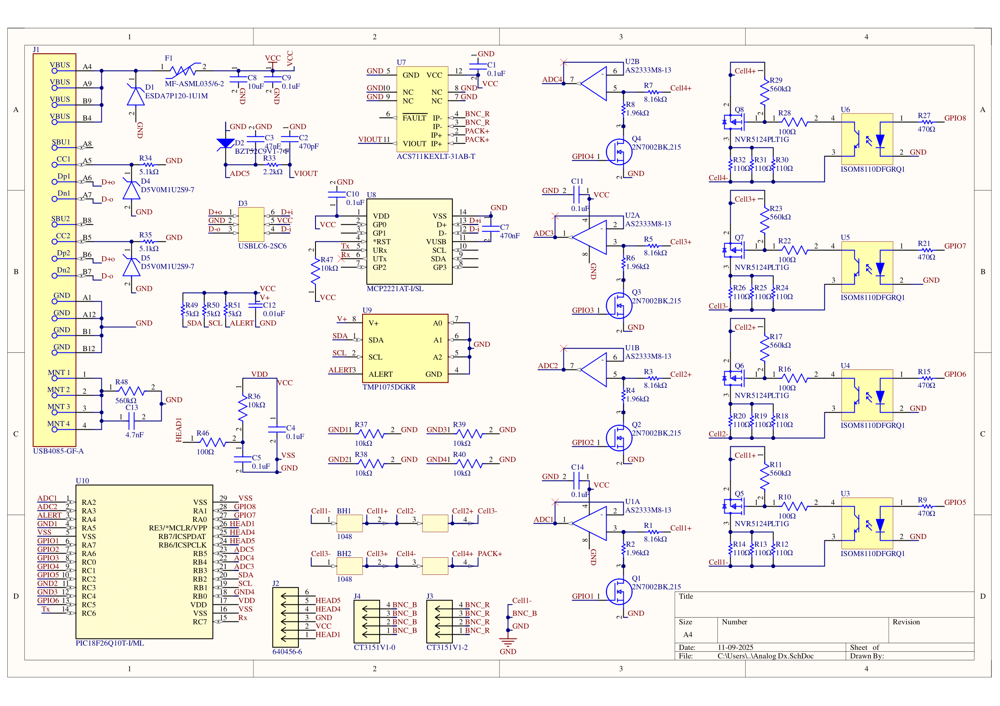

# 🔋 BMS-PCB-showcase

Custom multi-layer PCB for a 16.8 V, 4-cell Li-ion Battery Management System (BMS) implementing passive cell balancing, protection, and USB-C telemetry.
Designed for safe operation of small EV-scale battery packs and aligned with standard BMS topologies.

## Overview

The system monitors per-cell voltage, current, and temperature, computes state-of-charge, and performs passive balancing through high-current FET bleed paths.
Isolation between the pack and MCU is achieved using voltage-follower and opto-emulator stages to protect low-voltage logic during measurement.

## Features

- 4 x Li-ion cells (16.8 V pack)
- Passive balancing via precision resistors and FET discharge path
- Over-voltage, under-voltage, and over-temperature protection
- USB-C telemetry interface for external monitoring GUI
- MCU firmware (PIC family) for data acquisition and control
- Designed in Altium; schematic finalized and PCB layout in progress

> Project in progress - hardware under construction.
> More documentation and firmware to be added.